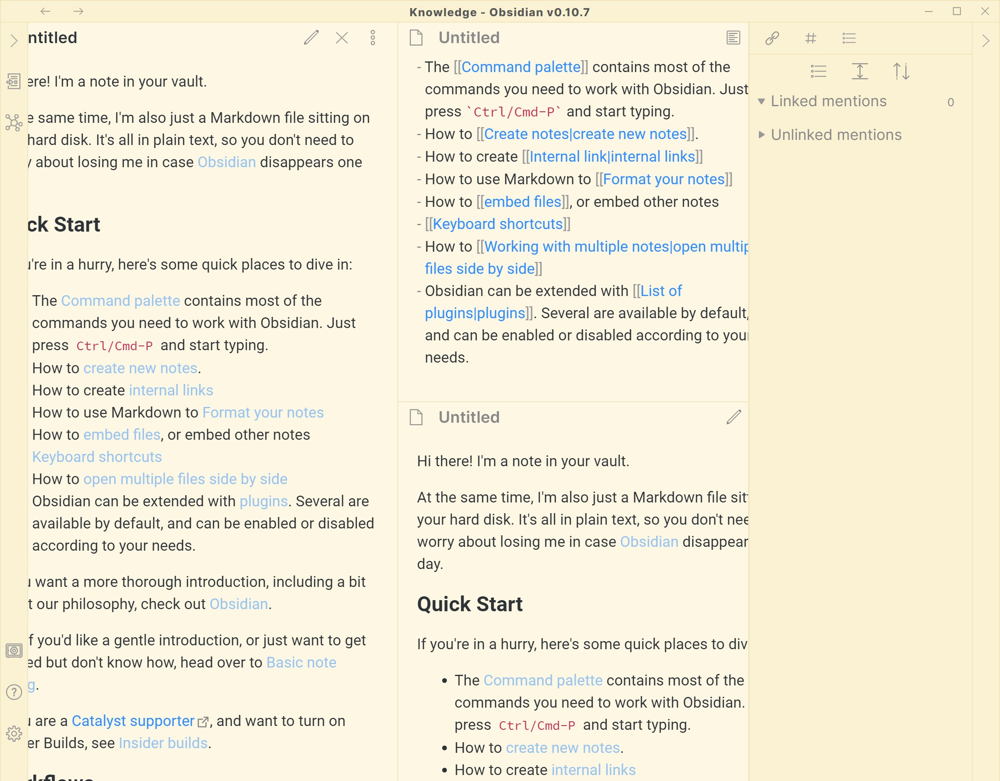
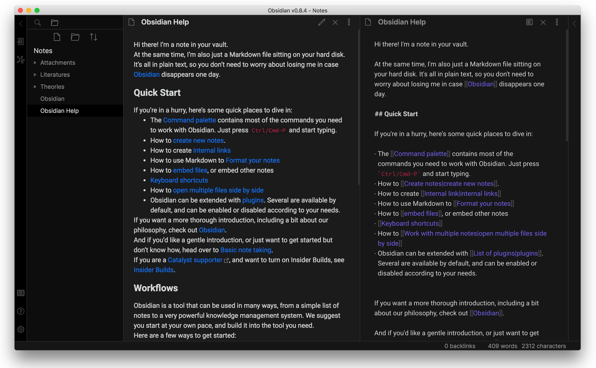

# Pure theme for Obsidian.md

A clean theme for `Obsidian.md`.

## Screenshots

## Installation

1. Download obsidian.css to your Obsidian vault folder.
2. `Roboto` font is required. 
3. In Obsidian, click Settings->Plugins and turn on "Custom CSS".